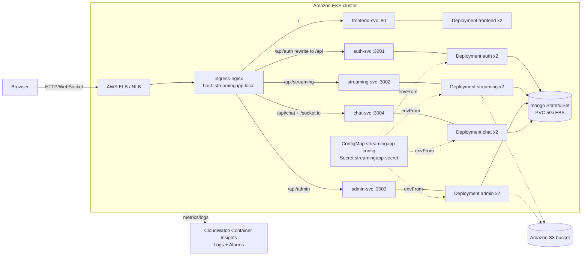
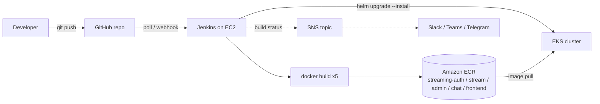

# StreamingApp - System Architecture

## 1. Application architecture

Five containers and one database. Every backend service is a Node.js/Express app sharing one MongoDB instance; the frontend is a React SPA served by Nginx.

| Component | Container port | Kubernetes Service | Responsibility |
| --- | --- | --- | --- |
| frontend | 80 | `frontend-svc` | React SPA (build-time API URLs) |
| authService | 3001 | `auth-svc` | Register, login, JWT issuance |
| streamingService | 3002 | `streaming-svc` | Video catalogue, S3 playback, thumbnails |
| adminService | 3003 | `admin-svc` | Asset management, signed uploads |
| chatService | 3004 | `chat-svc` | REST history + Socket.IO live chat |
| mongo | 27017 | `mongo` (headless) | Shared database (StatefulSet + PVC) |

## 2. Kubernetes / AWS deployment architecture

## 3. CI/CD architecture

## 4. Request routing (Ingress)

| Path | Backend | Notes |
| --- | --- | --- |
| `/` | `frontend-svc:80` | React SPA |
| `/api/auth/*` | `auth-svc:3001` | regex-rewritten to `/api/*` (auth serves `/api/register`, `/api/login`, ...) |
| `/api/streaming` | `streaming-svc:3002` | catalogue, playback, thumbnails |
| `/api/admin` | `admin-svc:3003` | uploads and curation |
| `/api/chat`, `/socket.io` | `chat-svc:3004` | REST history and WebSocket (1h proxy timeouts) |

## 5. Design decisions

- **One shared Helm helper** renders every Deployment/Service, so probes, resources and the rolling-update policy are defined once.
- **Zero-downtime updates**: `RollingUpdate` with `maxUnavailable: 0`, `maxSurge: 1`, gated by readiness probes on each service's health endpoint (`/health` for auth, `/api/health` for others, `/` for the frontend).
- **Configuration split**: non-secret values in a ConfigMap, `JWT_SECRET` and AWS keys in a Secret; both injected with `envFrom`.
- **MongoDB** runs as a single-replica StatefulSet with a PVC; reach it at `mongo:27017`.
- **Frontend API URLs are build-time** (Create React App). `scripts/build-push.sh` bakes `APP_URL` into the bundle, so rebuild the frontend image if the public URL changes.

## 6. Production hardening (what I would change)

Run each environment in its own namespace; terminate TLS at the Ingress with cert-manager (`ingress.tls.enabled=true`); add HorizontalPodAutoscalers on CPU for streaming/chat; replace the in-cluster MongoDB with a replica set or Amazon DocumentDB / Atlas; move secrets to AWS Secrets Manager (External Secrets Operator) and use IRSA instead of static AWS keys; add NetworkPolicies, PodDisruptionBudgets and pinned image digests.
